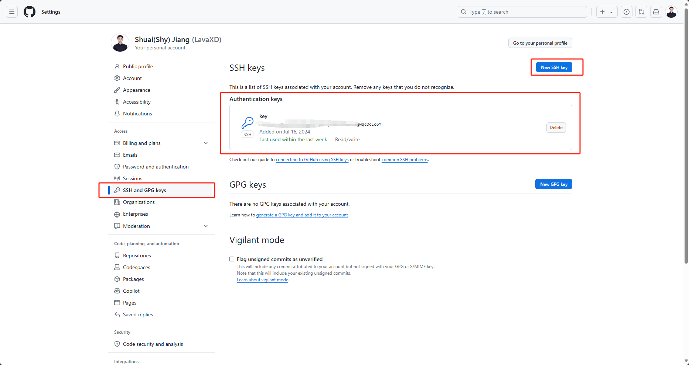

Notes about pushing local code to remote github repository
##1  Generate key using following command
```bash
ssh-keygen -t rsa -b 4096 -C "your_email@example.com"
```

##2 Go to C/Users/'your user'/.ssh/key.pub, open the file, copy the key and paste it into github as SSH key


##3 Use following command to start SSH proxy 
```bash
eval $(ssh-agent -s)
```

##4 Add your key to SSH proxy (zhongqing922)
```bash
ssh-add ~/.ssh/mykey
```

##5 Test connection to Github
```bash
ssh -T git@github.com 
```

##6 Git commands to commit/push
```bash
git init
git add .
git commit -m "Initial commit"
git remote add origin <url>
git fetch
git switch <branch name>
git pull origin shy --allow-unrelated-histories
git push -u origin master
git merge <branch name>
```

